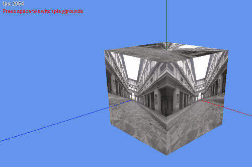

<h1 align="center">
  <br>
   <a>Monogame Shader Playgrounds - Yet another set of basic HLSL shaders examples for Monogame</a>
  <br>
</h1>

<p align="center">
  <a href="#description">Description</a> •
  <a href="#how-to-use">How To Use</a> •
  <a href="#credits">Credits</a> •
  <a href="#license">License</a>
</p>

<p align="center">
  
</p>

## Description

All is in the title, this repos is for having handy and ready to use HLSL Shaders with their C# code to be directly used in a Monogame project. Actual Monogame target version : 3.8.1.303.

Each rendering demo is a **Playground**. Playgrounds:
- Aim at having **all the needed code to run** with a copy/past of its folder **in a blank Monogame project** and have it working with little to no modification.
- Won't use metasyntactic, and truncated variable and function names or any acronyms to help fully understand what does what.  
- Aim to be **minimal straight-to-the-point** code to achieve the rendering, regardless of platform support, edge cases, optimisation or configurability.
- Are using a shader .fx file in its own folder but expect to be loaded from "Shaders/shader_filename" by the Monogame ContentManager. So MCGB-Editor is using linked file (aka the .fx file are outside the usual "Content" folder).
- Will depend on the BasicCamera for the usual needed View/World/Projection matrices.
- Are placed in the folder _Playgrounds_, then one folder per Playground.

All this is a tool for me so that I can prototype/test quickly some nice or specific rendering method in my Monogame projects. Hope it helps someone else!

## How To Use

To clone and run this application, you'll need [Git](https://git-scm.com), with [Visual Studio 2019 or 2022 Community](https://visualstudio.microsoft.com/downloads/) installed on your computer or [Visual Studio Code](https://code.visualstudio.com/download). Make sure to follow those [Monogame install instructions](https://docs.monogame.net/articles/getting_started/1_setting_up_your_development_environment_windows.html) too. You can skip the install of MonoGame extension and MGCB Editor.
Then from your command line:

```bash
# Clone this repository
$ git clone https://github.com/EtienneLorthoy/monogame-shader-samples-playground.git

# Go into the repository
$ cd monogame-shader-samples-playground/src

# Launch
$ dotnet run
```

## Credits

This software uses the following open source packages:
- [Monogame](https://www.monogame.net/)

## License

MIT License

Permission is hereby granted, free of charge, to any person obtaining a copy
of this software and associated documentation files (the "Software"), to deal
in the Software without restriction, including without limitation the rights
to use, copy, modify, merge, publish, distribute, sublicense, and/or sell
copies of the Software, and to permit persons to whom the Software is
furnished to do so, subject to the following conditions:

The above copyright notice and this permission notice shall be included in all
copies or substantial portions of the Software.

THE SOFTWARE IS PROVIDED "AS IS", WITHOUT WARRANTY OF ANY KIND, EXPRESS OR
IMPLIED, INCLUDING BUT NOT LIMITED TO THE WARRANTIES OF MERCHANTABILITY,
FITNESS FOR A PARTICULAR PURPOSE AND NONINFRINGEMENT. IN NO EVENT SHALL THE
AUTHORS OR COPYRIGHT HOLDERS BE LIABLE FOR ANY CLAIM, DAMAGES OR OTHER
LIABILITY, WHETHER IN AN ACTION OF CONTRACT, TORT OR OTHERWISE, ARISING FROM,
OUT OF OR IN CONNECTION WITH THE SOFTWARE OR THE USE OR OTHER DEALINGS IN THE
SOFTWARE.

---
> [etiennelorthoy.com](https://etiennelorthoy.com) &nbsp;&middot;&nbsp;
> LinkedIn [@etiennelorthoy](https://www.linkedin.com/in/etienne-lorthoy/) &nbsp;&middot;&nbsp;
> GitHub [@etiennelorthoy](https://github.com/EtienneLorthoy) &nbsp;&middot;&nbsp;
> Twitter [@ELorthoy](https://twitter.com/ELorthoy)
